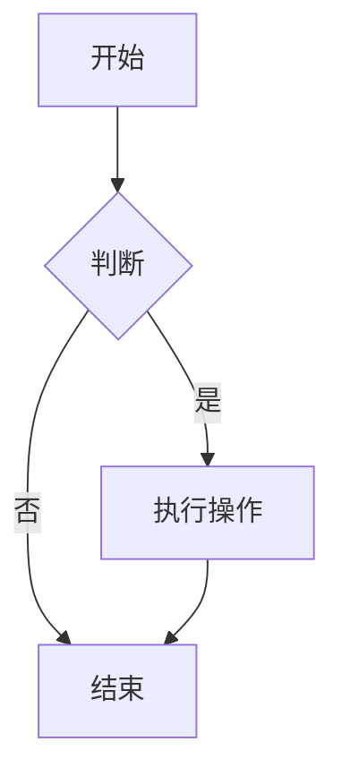
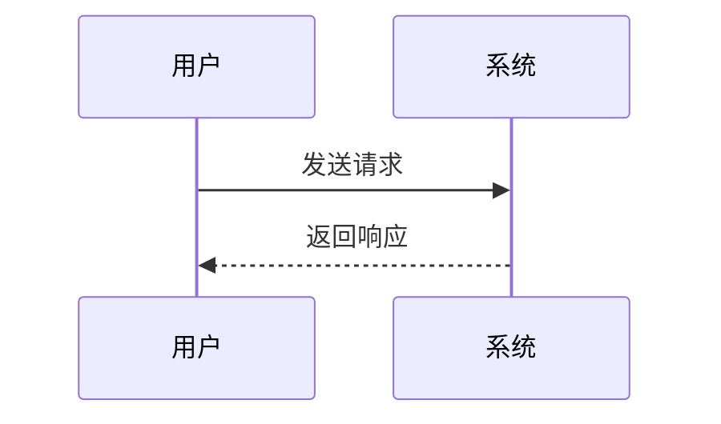

# 测试文件

这是一个普通段落。Lorem ipsum dolor sit amet, consectetur adipiscing elit. Sed do eiusmod tempor incididunt ut labore et dolore magna aliqua.

### 文本样式

_斜体文本_

**粗体文本**

_**粗斜体文本**_

~~删除线文本~~

`行内代码 inline code`

### 列表

- 项目 1
- 项目 2
  - 子项目 2.1
  - 子项目 2.2
    - 子子项目 2.2.1
- 项目 3

1. 第一项
2. 第二项
   1. 子项 2.1
   2. 子项 2.2
3. 第三项

- [x] 已完成任务
- [ ] 未完成任务
- [x] 另一个已完成任务

### 引用

> 这是一级引用
>
> > 这是二级嵌套引用
> >
> > > 这是三级嵌套引用
>
> 引用中可以包含其他元素：
>
> - 列表项
> - **粗体** 和 _斜体_
>
> 也可以包含代码 `console.log('hello')`

### 代码块

```javascript
function helloWorld() {
  const message = "Hello, World!";
  console.log(message);
  return message;
}
```

```
normal code block
普通代码块
```

### 表格

| 左对齐  | 居中对齐 |  右对齐 |
| :------ | :------: | ------: |
| 单元格1 | 单元格2  | 单元格3 |
| 单元格4 | 单元格5  | 单元格6 |
| 单元格7 | 单元格8  | 单元格9 |

| 名称 | 价格      | 数量 | 备注       |
| ---- | --------- | ---- | ---------- |
| 苹果 | ¥5.00     | 10   | 新鲜水果   |
| 香蕉 | **¥3.50** | 20   | _进口_     |
| 橙子 | `¥4.00`   | 15   | ~~促销中~~ |

Table: 表格测试2

### 链接

[普通链接](https://www.example.com)

[带标题的链接](https://www.example.com "示例网站")

[相对链接](./docs/guide.md)

[引用链接][reference-id]

[reference-id]: https://www.example.com "引用链接"

<https://www.example.com>

<email@example.com>


### 脚注

这是一个带脚注的句子[^1]。

[^1]: 这是脚注的内容。可以包含多行文本。FootNote Text.

### 定义列表

术语 1
: 定义 1
: 定义 2

术语 2
: 定义 3

### 上标与下标

H~~2~~O 是水的化学式

E=mc^2^ 是质能方程

## 五、扩展语法

### 5.4 数学公式

行内公式：$E = mc^2$

块级公式：

$$
\frac{n!}{k!(n-k)!} = \binom{n}{k}
$$

### Mermaid





## 二级标题 Heading2

### 三级标题 Heading3

#### 四级标题 Heading4

##### 五级标题 Heading5

###### 六级标题 Heading6
